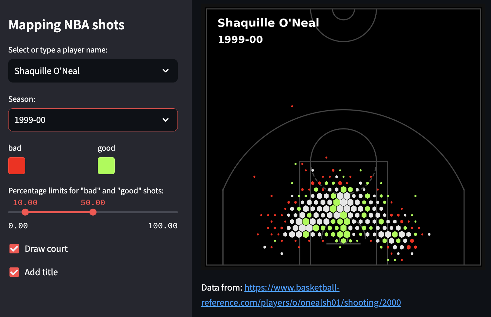

# nba-hexbin-app

Also deployed on [Hugging Face](https://huggingface.co/spaces/TristanCantat/hexplot-nba)

* Displays NBA player shooting charts per season.
* **Python libraries:** matplotlib, pandas, streamlit
* **Data source:** [Basketball-reference.com](https://www.basketball-reference.com/)

## Dockerfile

Once the `Dockerfile` is written, build an image with:

  docker build -t streamlit .

See it exists with:

  docker images

and run it with:

  docker run -p 8501:8501 streamlit

Then browse to http://0.0.0.0:8501
